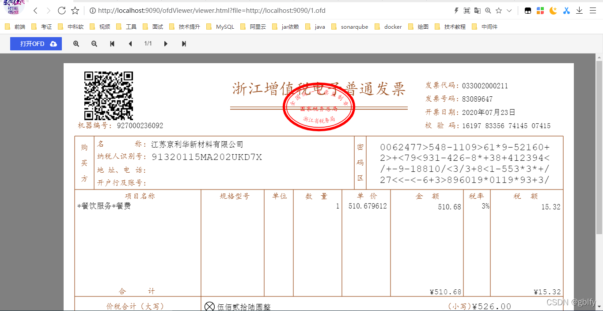

ofd和pdf 2种类型文件相互转换和ofd文件在线预览

ofd文件在线预览:
使用方式：

格式：/ofdViewer/viewer.html?file=1.ofd相对路径

案例：http://localhost:9090/ofdViewer/viewer.html?file=http://localhost:9090/ofd/1.ofd

ofd转pdf:
参考：OfdPdfApplicationTests中的ofdToPdf方法

pdf转ofd:
参考：OfdPdfApplicationTests中的PdfToOfd方法

参考链接：
[OFD文件、pdf文件相互转换、ofd文件在线预览](http://gblfy.blog.csdn.net/article/details/121734886)

效果图：

